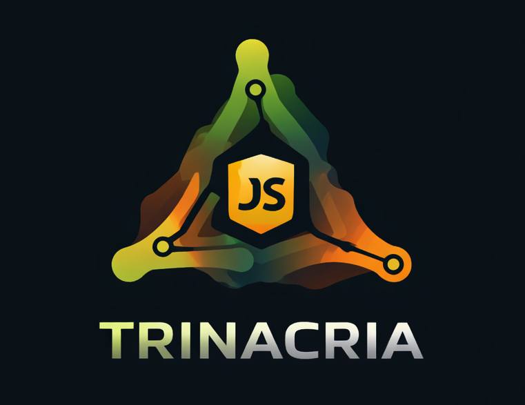

# Documentazione Trinacria (Italiano)

  

Questa sezione raccoglie la documentazione ufficiale in italiano.

## Indice

- [0000 - Getting Started (Da zero a prima API)](./0000-getting-started.md)
- [0001 - Runtime Foundation (Core Framework)](./0001-runtime-foundation.md)
- [0002 - Plugin HTTP](./0002-http-plugin.md)
- [0003 - CLI](./0003-cli.md)
- [0004 - Schema System](./0004-schema.md)
- [0005 - Plugin Cron](./0005-cron.md)

## Link Rapidi (Official IT)

- [Riferimento Middleware HTTP Built-in + Ricette](./0002-http-plugin.md)
- [Guida Plugin Cron + Hook Lock](./0005-cron.md)

## Ambito

- `@trinacria/core`: motore DI modulare, lifecycle applicativo, moduli, plugin.
- `@trinacria/http`: plugin HTTP (routing, middleware, controller, error handling).
- `@trinacria/cron`: plugin di schedulazione (job interval/cron, hook lock, rebuild runtime).
- `@trinacria/cli`: tool di sviluppo/esecuzione (`dev`, `build`, `start`).
- `@trinacria/schema`: DSL dichiarativa per schema dati (validazione, parsing, OpenAPI, type inference).
